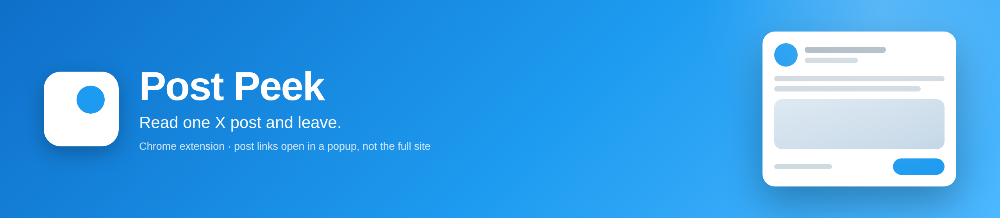
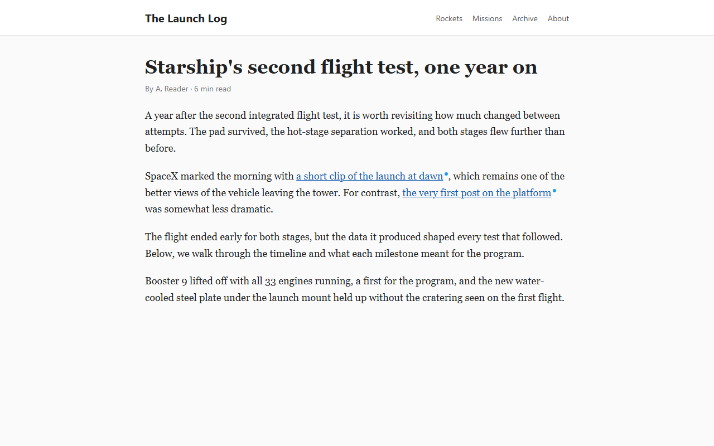
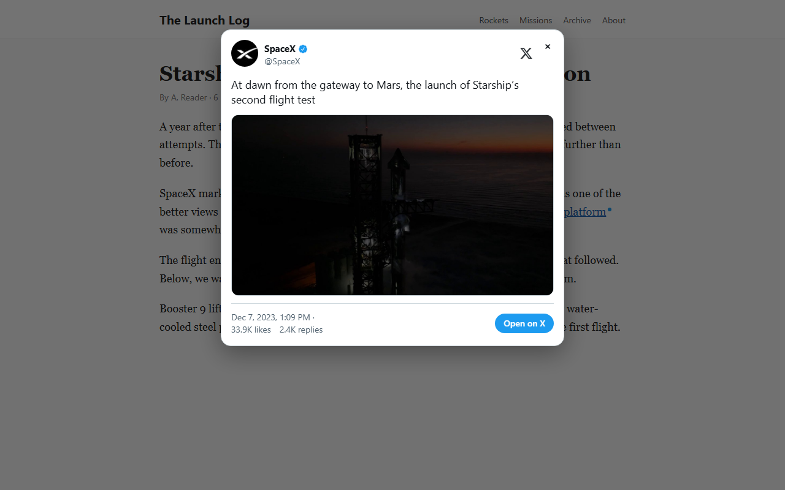

<p align="center">
  
</p>

<p align="center">
  <a href="https://github.com/tsvb/post-peek/releases"></a>
  <a href="LICENSE"></a>
  
  <a href="PRIVACY.md"></a>
</p>

<p align="center">
  <b>Read one X post and leave.</b><br>
  A Chrome (Manifest V3) extension that opens x.com and twitter.com post links in a popup
  instead of sending you to the full site.
</p>

<table>
  <tr>
    <td width="50%"></td>
    <td width="50%"></td>
  </tr>
  <tr>
    <td align="center"><sub><b>A blue dot marks a link Post Peek can open.</b></sub></td>
    <td align="center"><sub><b>Click it and the post opens in place. Esc closes it.</b></sub></td>
  </tr>
</table>

Post Peek is an independent, open-source project inspired by
[Litterbox](https://andadinosaur.com/launch-litterbox), the Safari extension by Zhenyi Tan
(And a Dinosaur). If you use Safari, use Litterbox itself - it came first, it is free, and
it is the better fit there. See [Credit](#credit).

## Features

- Opens post links in a popup so you can read just that post and close it.
- Marks openable links with a small blue dot.
- Renders text, photos, video, link cards, quoted posts, and reply context.
- Fetches posts from X's public syndication endpoint, the one behind X's own embedded posts.
- Never sends cookies or a Referer to X: posts and media are fetched anonymously, so X
  cannot tie a peek to your account or learn which site you were reading. No account needed.
- Never scans the page or touches its links. The dot is pure CSS; only the clicked link is inspected.
- Nothing for websites to probe: no web-accessible resources, and with dots turned off nothing whatsoever is written to the page.
- Settings stay on your device (`chrome.storage.local`, never synced).
- No data collection. See [PRIVACY.md](PRIVACY.md).

## Install from source

1. Open `chrome://extensions`, enable **Developer mode**, click **Load unpacked**, and pick this folder.
2. Serve this folder over HTTP and open the test page, for example:

   ```bash
   python -m http.server 8000
   ```

   then visit `http://localhost:8000/test.html`. The extension deliberately does not run on `file://` pages.

## Usage

- Click a post link to peek. Ctrl/Cmd-, Shift-, Alt- or middle-click opens the link normally.
- Esc or clicking the backdrop closes the popup. Quoted posts and "Replying to" open in the same popup.
- Toolbar button: toggle peeking, the dot marker, and the popup theme.

## Building for the Chrome Web Store

```bash
npm run build
```

This writes `dist/post-peek-<version>.zip` containing only the runtime files
(`manifest.json`, `src/`, `options/`, `icons/`) - the banner and store art are not packaged.
To regenerate artwork: `npm run icons` for the extension icons, `npm run banner` for the
banner above. Both need Chrome; set `CHROME` if it is not on the default Windows path.

## Releasing

1. Move the `Unreleased` notes in [CHANGELOG.md](CHANGELOG.md) under the new version.
2. Bump `version` in `manifest.json` and `package.json`, then commit.
3. Tag and push: `git tag v1.2.3 && git push origin v1.2.3`.

The [release workflow](.github/workflows/release.yml) checks that the tag matches the
manifest version, builds the zip, and attaches it to a GitHub release. Upload that same
zip to the Chrome Web Store.

## Layout

- `manifest.json` - MV3 manifest.
- `src/background.js` - service worker; fetches posts from `cdn.syndication.twimg.com` and proxies images when a page's CSP blocks `twimg.com`.
- `src/content.js` - intercepts clicks on post links and renders the popup inside a closed Shadow DOM.
- `src/content.css` - dot marker, matched purely on the link's `href`.
- `src/popup-css.js` - popup stylesheet embedded as a string (so nothing is web-accessible).
- `options/` - settings page (also the toolbar popup).
- `scripts/` - icon generator, README banner renderer, and zip builder.
- `test/` - dependency-free tests for the packaging and privacy invariants (`npm test`).
- `test.html` - page of links for checking dots and peeking by hand in the browser.
- `media/banner.png` - the banner at the top of this file; regenerate with `npm run banner`.
- `store/` - Chrome Web Store listing copy, screenshots, and promo tiles.

## Credit

Post Peek exists because of **Litterbox**, a Safari extension for iPhone, iPad, and Mac by
Zhenyi Tan, who publishes as And a Dinosaur:

- Launch post: [Launch: Litterbox](https://andadinosaur.com/launch-litterbox), 5 September 2026
- App Store, free: [Litterbox - Post Peeker](https://apps.apple.com/us/app/litterbox-post-peeker/id6805719216)
- Developer: [And a Dinosaur](https://andadinosaur.com)

Litterbox got there first with essentially every idea this extension is built on: open a
linked x.com post in a popup instead of going to the site; mark the links it can handle so
you know before you click; fetch the post through the same API X uses for its own website
embeds, so no cookies are sent; and leave a link out to X for when you do want the full
thread. Post Peek's blue dot is Litterbox's marker in another shape, and the name "Post
Peek" is a clip of Litterbox's own listing name, "Litterbox - Post Peeker".

Some of the words are theirs as well. "Read one X post and leave" is a compression of how
Litterbox describes itself on the App Store - "opens x.com links in a popup so you can read
the one post and leave."

Post Peek is a separate Chrome implementation of that idea, written from scratch. Litterbox
is closed source, so no Litterbox code or artwork is used here. Post Peek is not
affiliated with, endorsed by, or supported by Zhenyi Tan, And a Dinosaur, or X Corp, so
anything wrong with this extension is not theirs to answer for - report it on
[this repository's issues](https://github.com/tsvb/post-peek/issues).

## License

[MIT](LICENSE)
