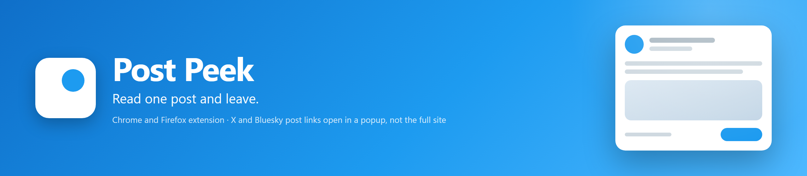
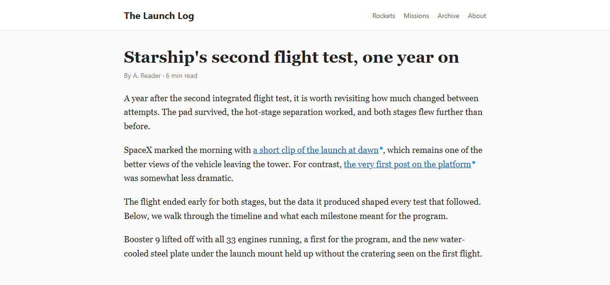
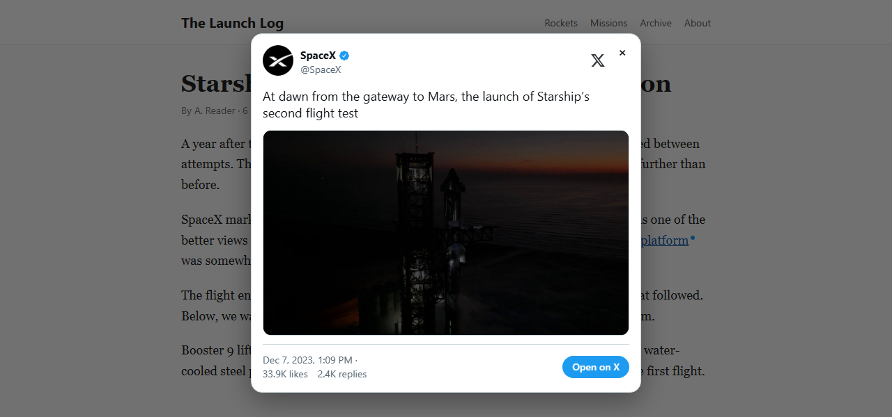

<p align="center">
  
</p>

<p align="center">
  <a href="https://chromewebstore.google.com/detail/nkjjgbkfdaembjfandhlgfijhbigblnn"></a>
  <a href="https://addons.mozilla.org/firefox/addon/post-peek/"></a>
  <a href="LICENSE"></a>
  
  <a href="PRIVACY.md"></a>
</p>

<p align="center">
  <b>Read one post and leave.</b><br>
  A Chrome and Firefox (Manifest V3) extension that opens x.com, twitter.com and bsky.app
  post links in a popup instead of sending you to the full site.
</p>

<p align="center">
  <a href="https://chromewebstore.google.com/detail/nkjjgbkfdaembjfandhlgfijhbigblnn"></a>
  <a href="https://addons.mozilla.org/firefox/addon/post-peek/"></a>
</p>

<table>
  <tr>
    <td width="50%"></td>
    <td width="50%"></td>
  </tr>
  <tr>
    <td align="center"><sub><b>A blue dot marks a link Post Peek can open.</b></sub></td>
    <td align="center"><sub><b>Click it and the post opens in place. Esc closes it.</b></sub></td>
  </tr>
</table>

Post Peek is an independent, open-source project inspired by
[Litterbox](https://andadinosaur.com/launch-litterbox), the Safari extension by Zhenyi Tan
(And a Dinosaur). If you use Safari, use Litterbox itself - it came first, it is free, and
it is the better fit there. See [Credit](#credit).
Post Peek is not affiliated with X Corp. or with Bluesky.

## Features

- Opens post links in a popup so you can read just that post and close it.
- Marks openable links with a small blue dot.
- Renders text, photos, video, link cards, quoted posts, and reply context.
- Fetches posts from X's public syndication endpoint, the one behind X's own embedded posts, and from Bluesky's public API.
- Never sends cookies, a Referer, or an Origin naming the page to X or Bluesky: posts and images are
  fetched by the extension itself and video plays in a sandboxed frame, so neither site can tie a peek
  to your account or learn which site you were reading. No account needed.
- Respects Bluesky authors who hide their posts from logged-out viewers and posts Bluesky's
  moderators have hidden, and keeps media labeled as adult or graphic behind a click.
- Never scans the page or touches its links. The dot is pure CSS; only the clicked link is inspected.
- Little for websites to probe: no web-accessible resources, no response to clicks a page fakes, and with dots turned off nothing is written to the page. (The dot stylesheet is always present, so a site that goes looking can still tell the extension is installed.)
- Bluesky video needs HLS playback, which Firefox does not have built in, so there a Bluesky video
  shows its thumbnail with a link to watch it on Bluesky.
- Settings stay on your device (local extension storage, never synced).
- No data collection. See [PRIVACY.md](PRIVACY.md).

## Install

[**Add to Chrome from the Chrome Web Store**](https://chromewebstore.google.com/detail/nkjjgbkfdaembjfandhlgfijhbigblnn) - the reviewed build, kept up to date
by Chrome.

[**Add to Firefox from addons.mozilla.org**](https://addons.mozilla.org/firefox/addon/post-peek/) -
the reviewed build, kept up to date by Firefox. Requires Firefox 140 or newer.

### From source

1. Chrome: open `chrome://extensions`, enable **Developer mode**, click **Load unpacked**,
   and pick this folder.

   Firefox: run `npm run build`, open `about:debugging#/runtime/this-firefox`, click
   **Load Temporary Add-on**, and pick `dist/post-peek-<version>-firefox.zip`. (Picking
   `manifest.json` in this folder does not work: that file is the Chrome manifest, and
   Firefox needs the rewritten one inside the zip.)
2. Serve this folder over HTTP and open the test page, for example:

   ```bash
   python -m http.server 8000
   ```

   then visit `http://localhost:8000/test.html`. The extension deliberately does not run on `file://` pages.

## Usage

- Click a post link to peek. Ctrl/Cmd-, Shift-, Alt- or middle-click opens the link normally.
- The toolbar icon opens the settings: peeking on or off, on or off for X and Bluesky separately, the dot marker, and the popup theme.
- Esc or clicking the backdrop closes the popup. Quoted posts and "Replying to" open in the same popup.
- Toolbar button: toggle peeking, the dot marker, and the popup theme.

## Building for the stores

```bash
npm run build
```

This writes two zips containing only the runtime files (`manifest.json`, `src/`,
`options/`, `icons/`) - the banner and store art are not packaged:

- `dist/post-peek-<version>.zip` for the Chrome Web Store, with `manifest.json` as checked in.
- `dist/post-peek-<version>-firefox.zip` for addons.mozilla.org. Same files, but the manifest
  is rewritten by `scripts/firefox-manifest.js`: Firefox runs `src/background.js` as an
  event page rather than a service worker, and the manifest carries the add-on ID, the
  minimum Firefox version, and the data-collection declaration AMO requires.

To check the Firefox zip the way AMO will, unzip it and run `npx web-ext lint` on the
folder; the release workflow does this on every tag.
To regenerate artwork: `npm run icons` for the extension icons, `npm run media` for the
banner and screenshots above. Both need Chrome; set `CHROME` if it is not on the default
Windows path.

## Releasing

1. Move the `Unreleased` notes in [CHANGELOG.md](CHANGELOG.md) under the new version.
2. Bump `version` in `manifest.json` and `package.json`, then commit.
3. Tag and push: `git tag v1.2.3 && git push origin v1.2.3`.

The [release workflow](.github/workflows/release.yml) checks that the tag matches the
manifest version, builds both zips, lints the Firefox one, and attaches both to a GitHub
release. Upload the plain zip to the Chrome Web Store and the `-firefox` zip to
addons.mozilla.org.

## Layout

- `manifest.json` - MV3 manifest for Chrome. The Firefox manifest is derived from it at build time.
- `src/background.js` - service worker (event page on Firefox); fetches posts from `cdn.syndication.twimg.com` and `public.api.bsky.app`, and fetches every image the popup shows, so no image request comes from the page.
- `src/content.js` - intercepts clicks on post links and renders the popup inside a closed Shadow DOM, with video in a sandboxed frame.
- `src/content.css` - dot marker, matched purely on the link's `href`.
- `src/popup-css.js` - popup stylesheet embedded as a string (so nothing is web-accessible).
- `options/` - settings page (also the toolbar popup).
- `scripts/` - icon generator, README artwork renderer, zip builder, and the Chrome-to-Firefox manifest rewrite.
- `test/` - dependency-free tests for the packaging and privacy invariants (`npm test`).
- `test.html` - page of links for checking dots and peeking by hand in the browser.
- `media/` - banner and the cropped screenshots used above; regenerate with `npm run media`.
- `store/` - Chrome Web Store and addons.mozilla.org listing copy, screenshots, and promo tiles.

## Credit

Post Peek exists because of **Litterbox**, a Safari extension for iPhone, iPad, and Mac by
Zhenyi Tan, who publishes as And a Dinosaur:

- Launch post: [Launch: Litterbox](https://andadinosaur.com/launch-litterbox), 5 September 2026
- App Store, free: [Litterbox - Post Peeker](https://apps.apple.com/us/app/litterbox-post-peeker/id6805719216)
- Developer: [And a Dinosaur](https://andadinosaur.com)

Litterbox got there first with essentially every idea this extension is built on: open a
linked x.com post in a popup instead of going to the site; mark the links it can handle so
you know before you click; fetch the post through the same API X uses for its own website
embeds, so no cookies are sent; and leave a link out to X for when you do want the full
thread. Post Peek's blue dot is Litterbox's marker in another shape, and the name "Post
Peek" is a clip of Litterbox's own listing name, "Litterbox - Post Peeker".

Some of the words are theirs as well. "Read one X post and leave" is a compression of how
Litterbox describes itself on the App Store - "opens x.com links in a popup so you can read
the one post and leave."

Post Peek is a separate Chrome and Firefox implementation of that idea, written from scratch. Litterbox
is closed source, so no Litterbox code or artwork is used here. Post Peek is not
affiliated with, endorsed by, or supported by Zhenyi Tan, And a Dinosaur, X Corp. or Bluesky, so
anything wrong with this extension is not theirs to answer for - report it on
[this repository's issues](https://github.com/tsvb/post-peek/issues).

## License

[MIT](LICENSE)

Made by [Tim VanBenschoten](https://timvanbenschoten.com).
